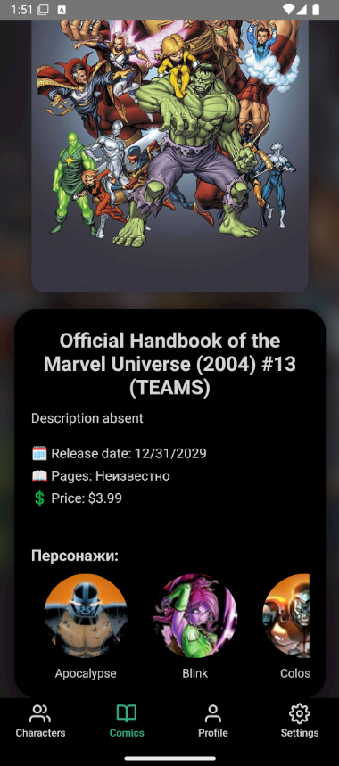
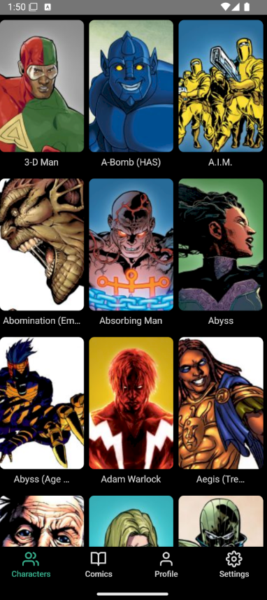
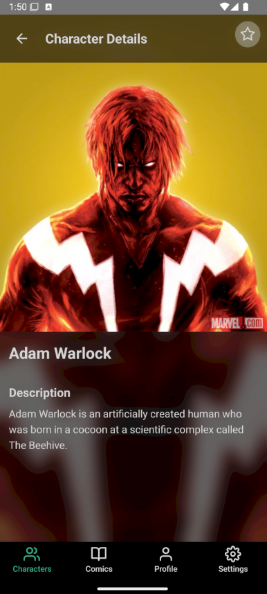
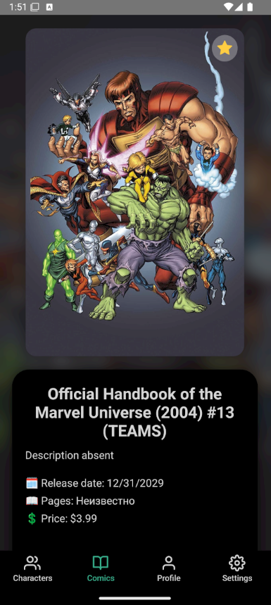
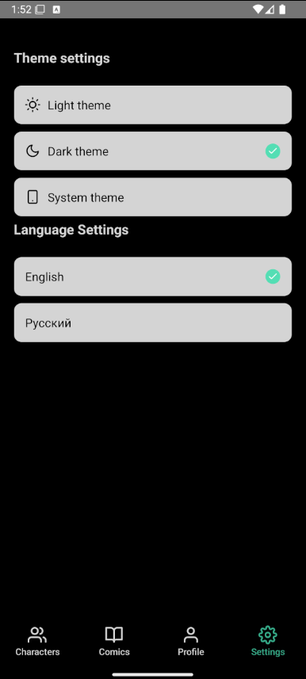
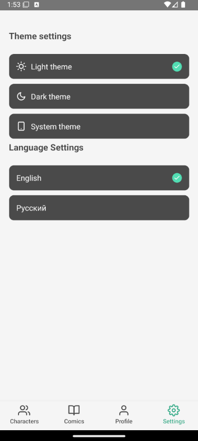
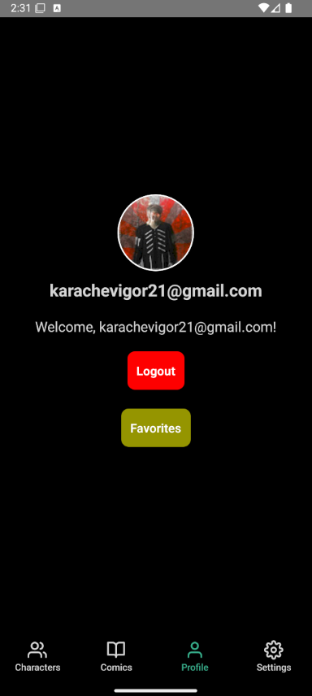
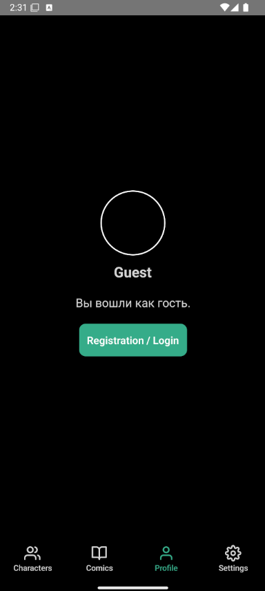
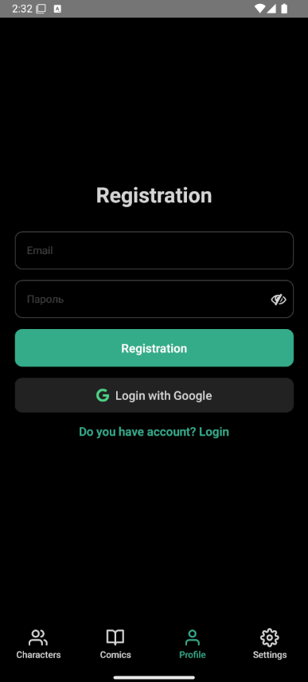
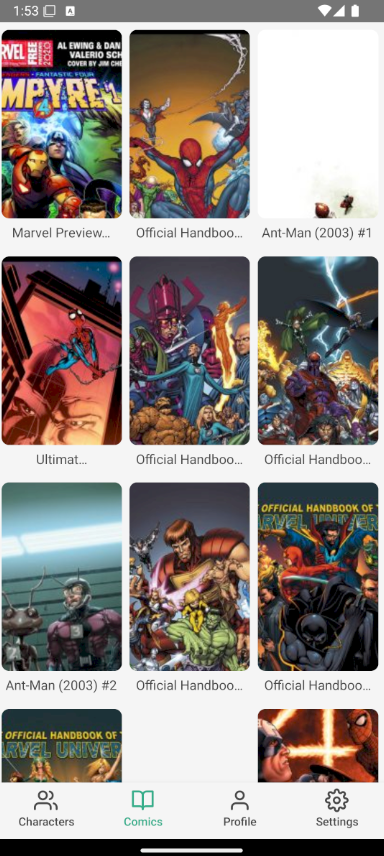

# Marvel Comics Explorer 🚀

[](https://reactnative.dev/)
[](https://firebase.google.com/)
[](https://feature-sliced.design/)

**Marvel Comics Explorer** - A mobile app for comic enthusiasts offering an immersive content experience. Discover:

🌟 **Characters** and **comics** with detailed views  
💖 **Favorites** system with cross-device sync  
🎨 Personalized **theme** and **language** settings  
🔐 Flexible auth via **Google** or **Email**  
🌍 Russian/English support via **Yandex Translate API**

<div align="center">
  
  
  
</div>

## 🚀 Key Features

### 🔒 Smart Authentication
- **Guest mode** with limited access
- Registration via:
  - 📧 Email + password
  - 🔵 Google OAuth 2.0
- Automatic user data sync

### 🎨 Personalization
- Three theme modes:
  - 🌓 System default
  - 🌙 Dark mode
  - ☀️ Light mode
- Dynamic language switching using Yandex API

### 📚 Content Management
- Interactive comics gallery with:
  - 📖 Page-by-page viewing
  - 🔍 Detailed information
- Character catalog featuring:
  - 🧬 Biography stats
  - 🔗 Related comics

### ⚙️ Tech Stack
| Technology              | Purpose                         |
|-------------------------|---------------------------------|
| React Native CLI        | Core framework                  |
| Firebase Firestore      | Cloud DB & caching              |
| React Navigation v6     | Navigation & deep linking       |
| FSD Architecture        | Project structure               |
| Yandex.Translate        | Localization                    |

## 🛠 Installation

1. Clone repository:
```bash
git clone https://github.com/your-username/comicverse.git
cd comicverse
```

2. Install dependencies:
```bash
npm install
# OR
yarn
```

3. Configure Firebase:
- Create project in [Firebase Console](https://console.firebase.google.com/)
- Add config files: `google-services.json` (Android) and `GoogleService-Info.plist` (iOS)

4. Run the app:
```bash
npx react-native run-android
# OR
npx react-native run-ios
```

## 🏗 Architecture (FSD)
```
src/
├── app/                  # App initialization
├── pages/                # Screen components
├── widgets/              # Reusable UI blocks
├── features/             # Feature implementations
└── shared/               # Utilities, API configs, global styles
```

## 🌍 Localization
Translation system powered by Yandex Translate API:
```javascript
import axios from 'axios';

const FOLDER_ID = "YOUR_FOLDER_ID";
const IAM_TOKEN = "YOUR_IAM_TOKEN";
const TRANSLATE_API_URL = "https://translate.api.cloud.yandex.net/translate/v2/translate";

export const translateText = async (text: string, targetLanguage: string) => {
  try {
    const response = await axios.post(
      TRANSLATE_API_URL,
      {
        folder_id: FOLDER_ID,
        texts: [text],
        targetLanguageCode: targetLanguage,
      },
      {
        headers: {
          Authorization: `Bearer ${IAM_TOKEN}`,
          "Content-Type": "application/json",
        },
      }
    );

    return response.data.translations[0].text;
  } catch (error) {
    console.error("Translation error:", error);
    throw error;
  }
};
```

## 🎨 App Interface

<div align="center">
  <div style="display: flex; flex-wrap: wrap; justify-content: center; gap: 20px; margin-bottom: 30px;">

<div style="flex: 1 1 220px; text-align: center;">
      
      <br/>
      <sub style="font-size: 14px; color: #666;">🦸 Characters Screen</sub>
    </div>

<div style="flex: 1 1 220px; text-align: center;">
      
      <br/>
      <sub style="font-size: 14px; color: #666;">🖼 Character Details</sub>
    </div>

<div style="flex: 1 1 220px; text-align: center;">
      
      <br/>
      <sub style="font-size: 14px; color: #666;">📚 Comics Catalog</sub>
    </div>

<div style="flex: 1 1 220px; text-align: center;">
      
      <br/>
      <sub style="font-size: 14px; color: #666;">🖼 Comic Details</sub>
    </div>

<div style="flex: 1 1 220px; text-align: center;">
      
      <br/>
      <sub style="font-size: 14px; color: #666;">⚙️ Theme & Language Settings</sub>
    </div>

<div style="flex: 1 1 220px; text-align: center;">
      
      <br/>
      <sub style="font-size: 14px; color: #666;">⚙️ Light Theme Preview</sub>
    </div>

<div style="flex: 1 1 220px; text-align: center;">
      
      <br/>
      <sub style="font-size: 14px; color: #666;">👤 User Profile</sub>
    </div>

<div style="flex: 1 1 220px; text-align: center;">
      
      <br/>
      <sub style="font-size: 14px; color: #666;">👤 Guest Profile</sub>
    </div>

<div style="flex: 1 1 220px; text-align: center;">
      
      <br/>
      <sub style="font-size: 14px; color: #666;">📝 Registration Screen</sub>
    </div>

<div style="flex: 1 1 220px; text-align: center;">
      
      <br/>
      <sub style="font-size: 14px; color: #666;">📚 Light Theme Comics</sub>
    </div>

  </div>
</div>

## 📄 License
This project is licensed under the [MIT License](LICENSE).

---
<div align="center">
  Made with ❤️ for the comics community | 2023
</div>
